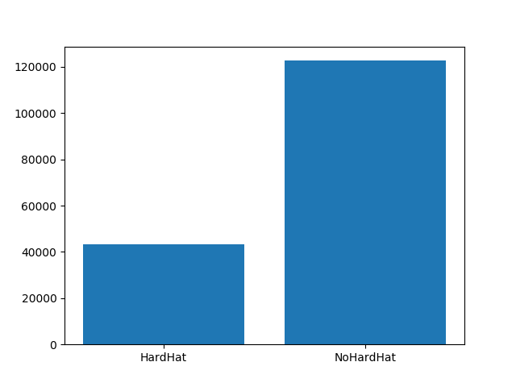
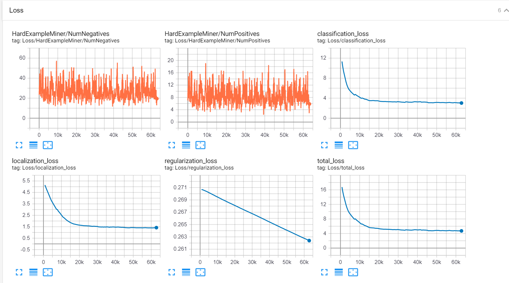
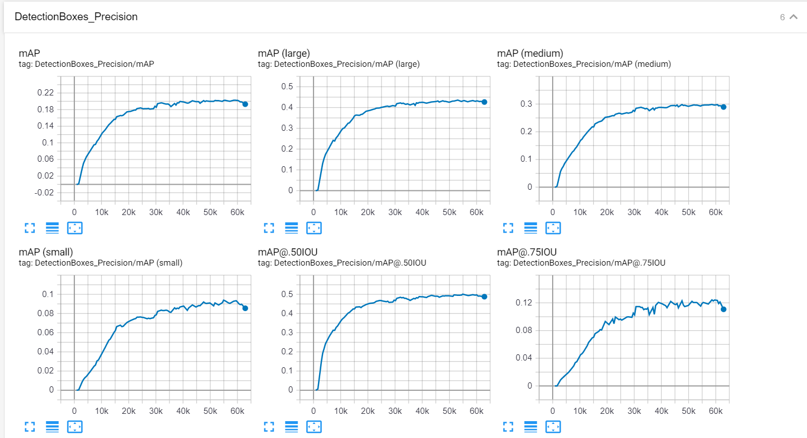
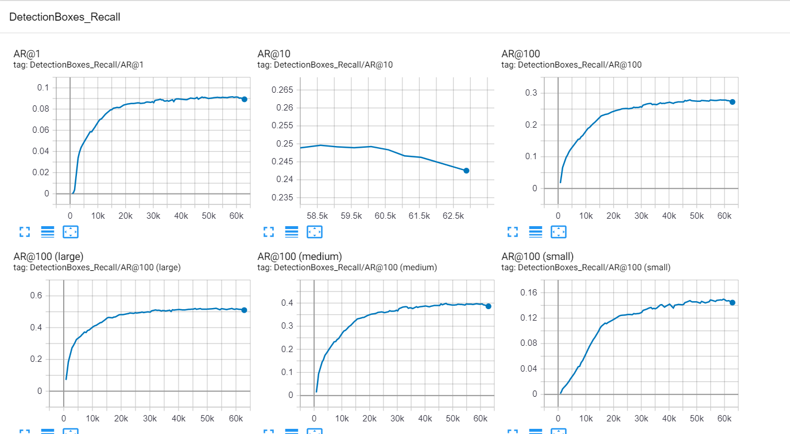

# Construction Safety Using Deep Learning

OSHA demonstrated that eliminating the Fatal Four would save 582 construction workers' lives in America every year. This motivated the development of SafetyNet, an object detection model trained on cloud TPUs that detects whether workers are wearing personal protective equipment.

#### Excerpts from the Attached Statistics (See Construction Accident Data folder)

**Fatalities**

US Dept Labour 2017 Detailed Report
-	Vehicular contact with a person (23)
-	Object or equipment contact with a person (80)
-	Falls to a lower level (366)
-	Exposure to electricity (71)

US Dept Labour 2011-2017 Report
-	The central causes in the 2017 Detailed Report are representative of all the years 2011-2017
-	Ladders and roofs are significant factors
-	The head and the trunk are the main injury locations

**Injury Claims**
-	The greatest claim frequency is Overexertion, followed by Struck-by, and then Falls to a lower level

**Feature Engineering**
-	Number of people above ground level
-	Number of distinct optical flows
-	Number of people
-	Locations and depths of people 
-	Locations and depths of optical flows
-	Repetitive Motion – Separate Model -> Overexertion 
-	Presence of Personal Protective Equipment (PPE)

### PPE Data

**Using ~50,000 images, several object detection experiments were run to train a model to effectively detect the presence of personal protective equipment**

For example, there were around 43,000 instances of Person Wearing a Hard Hat present in this dataset, and 120,000 instances of Person Not Wearing a Hard Hat. It is important to distinguish between the presence of a <ins>Hard Hat</ins> and the presence of a <ins>Person Wearing a Hard Hat</ins>.
 

### Training the Model
**The main difficulty of the task is the constraint of having the model run on-the-edge while striving to detect small objects (PPE from a distance)**

The model was selected based on the following criteria:
- TPU inference compatibility
- Reasonable Performance (based on the MSCOCO Evalution Protocol)
- (Optional) ability to be trained on a TPU

### Pre-trained Model Configurtions that were Considered
- SSD MobileNet V2 (COCO)
- SSD MobileNet V2 (Faces)
- SSD Inception V2
- SSD MobileNet FPN V1 (Feature Pyramid Network)
- RetinaNet

### Results

The FPN network performed the best overall (in terms of recall and precision of detecting small, medium and large objects). The next best choice was the Faces SSD MobileNet V2 model, which has helpful augmentations like keypoint flip permutations. The RetinaNet wasn't trained, but I hope to attempt this pipeline in the future.

**An Overview of the FPN Performance (First Training)**
 

**Loss**

 

**Precision**

 

**Recall**

